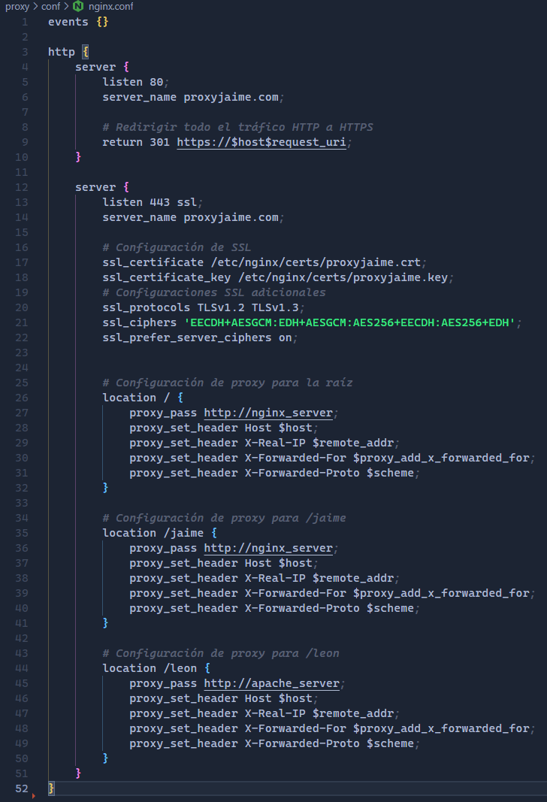
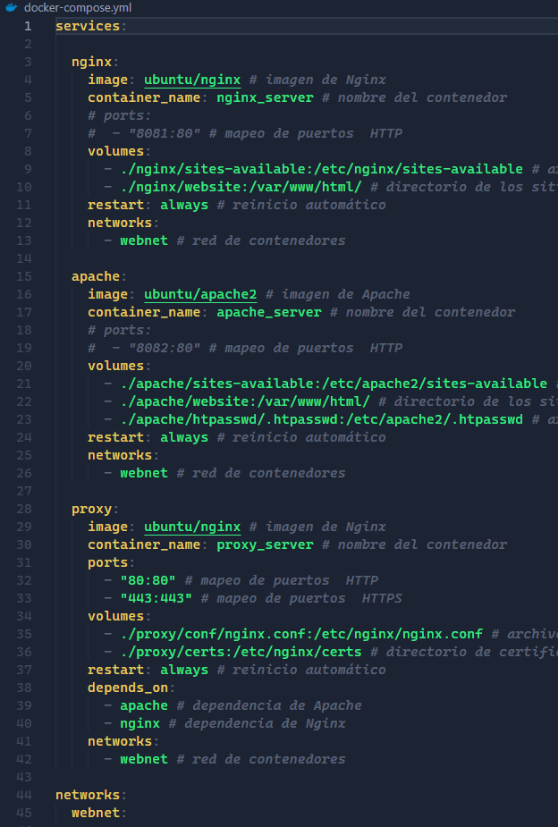
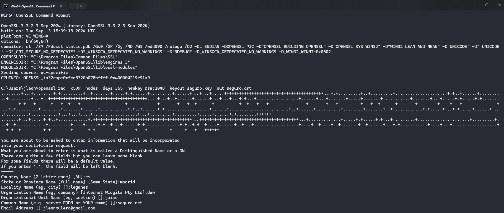
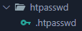

# Tutorial-Nginx-Web

<span style="color:lime; font-size:17px"> **Buscad los archivos en el proyecto para usarlos de referencia en vuestras creaciones**

## Estructura de archivos

Creamos la siguiente estructura de archivos (solo lo nombrado a continuación):

- Creamos carpeta `proxy` donde estará la configuración por defecto de Nginx y el certificado.



- Creamos carpeta `conf` dentro de proxy. Dentro de esta añadimos el archivo `nginx.conf` que tendrá la siguiente configuración.


- Creamos carpeta `certs` y dentro creamos carpeta `conf`. Dentro de esta añadimos el archivo `nginx.conf` que tendrá la siguiente configuración.


- Creamos carpeta `sites-available`, copiamos archivo `default` y creamos archivos `conf` para cada webhost que vayamos a generar.


- Archivo `jaime.conf` para web sin protocolo SSL.


- Archivo `seguro.conf` para web con protocolo SSL.


- Creamos carpeta `website` y dentro creamos una carpeta para cada webhost.


- Creamos `html` de web por defecto dentro de `website` y `html` de cada web dentro de su carpeta.


- Creamos carpeta `errors` y dentro cada `html` de cada error que vayamos a controlar.


- Creamos carpeta `privado` dentro del webhost que configuraremos con SSL. A esta solo se accederá al iniciar sesión con el usuario autenticado. Además, crearemos el archivo `.htaccess` dentro.


- Creamos `script` con los comandos que realizará el contenedor automáticamente al iniciarse. En nuestro caso habilitaremos los sitios creados, habilitaremos el módulo ssl y reiniciaremos el servicio de `Apache` para aplicar los cambios.


- Creamos carpeta `htpasswd` (el archivo se añadirá más tarde).


- Creamos carpeta `certs` (los archivos se añadirán más tarde).


- Creamos `docker-compose.yml` con la configuración de nuestro contenedor.




## Generación de certificados

Instalamos el programa **OpenSSL**.

Abrimos la terminal de OpenSSL y ejecutamos el siguiente comando (cambiar `seguro` por nombre de webhost):

```bash
openssl req -x509 -nodes -days 365 -newkey rsa:2048 -keyout seguro.key -out seguro.crt
```

Nos pedirá una serie de datos. Respondemos a los datos que pide y en el **Common Name** ponemos el nombre del webhost incluida la extensión (`seguro.net`).



Estos archivos se generarán en la ruta donde ejecutes el comando. Copia estos archivos a la carpeta `certs`.

## Modificación del archivo hosts

Modificamos el archivo `hosts` de nuestro PC para generar los DNS de nuestros webhosts.

Vamos a la ruta: `C:\Windows\System32\drivers\etc`

Dentro de esta habrá un archivo `hosts`. Haremos una copia de este como backup.

Modificamos el archivo `hosts` añadiendo las IPs y nombres de nuestros webhosts.


## Lanzamiento del contenedor

Lanzamos nuestro `docker-compose.yml` en la terminal con el comando:

```bash
docker-compose –build -d
```

Si tenemos algún error podemos borrar lo generado con el comando:

```bash
docker-compose down
```

Para acceder a la terminal del servidor generado usamos el comando:

```bash
docker exec -it nginx_server /bin/bash
```

(También sirve `bash`).


## Generación del archivo .htpasswd

Generamos archivo `.htpasswd` con el usuario y contraseña que deseemos.

Una vez dentro de la terminal de Nginx, iremos a la ruta `/etc/nginx`.

Con el comando `ls -a` vemos los archivos ocultos y podemos ver que existe el archivo `.htpasswd`. En caso de no existir, lo generaremos nuevo, y si existe lo sobreescribiremos.

Antes de pasar al comando debemos instalarlo, ya que este es una herramienta de Apache que no tendremos por defecto. Para ello realizaremos los siguientes comandos:

```bash
apt update && apt install apache2-utils
```

Generamos el archivo con el siguiente comando:

```bash
htpasswd -c /etc/nginx/.htpasswd nombre_usuario
```

En `usuario` pondremos el nombre del usuario que queramos, y la contraseña la introduciremos cuando nos la pida.



El archivo se copiará directamente en la ruta de nuestro proyecto al haber creado el volumen en el `docker-compose.yml`.

## Pruebas en el navegador

Ahora abrimos el navegador y buscamos las siguientes rutas:

- `http://jaime.com:80`


- `http://leon.com:80`


- `https://seguro.net:443`


- `https://seguro.net/privado` ➡️ **Aquí introducimos los credenciales generados con htpasswd**


# Autor

Realizado por [Jaime León Mulero](https://github.com/jaimeleon10)

