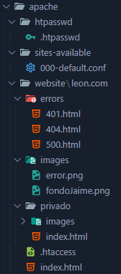
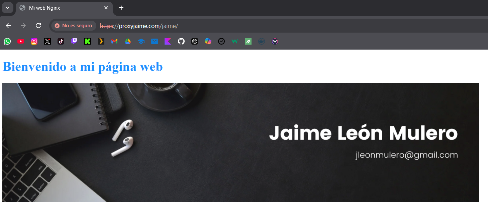

# Tutorial-Nginx-Web

<span style="color:lime; font-size:17px"> **Buscad los archivos en el proyecto para usarlos de referencia en vuestras creaciones**

## Estructura de archivos

Creamos la siguiente estructura de archivos (solo lo nombrado a continuación):

- Creamos carpeta `proxy` donde estará la configuración por defecto de Nginx y el certificado.


- Creamos carpeta `conf` dentro de `proxy`. Dentro de esta añadimos el archivo `nginx.conf` que tendrá la siguiente configuración.


- Creamos carpeta `certs` dentro de `proxy`. Dentro de esta añadiremos los archivos del certificado más delante.


- Creamos carpeta `nginx` donde estará la configuración del proxy y de la web con Nginx.


- Creamos carpeta `sites-available` dentro de `nginx` y añadimos archivo `default` con la configuración del proxy y de la web `/nombre` así como sus páginas de errores.


- Creamos carpeta `website` dentro de `nginx` y dentro añadimos los dintintos HTML que formarán nuestra web `/nombre`.


- Creamos carpeta `apache` donde estará la configuración de la web con Apache.



- Creamos carpeta `sites-available` dentro de `apache` y dentro añadimos archivo `000-default.conf` con la configuración de la web `/apellido`, la web `/privado` dentro de esta y sus páginas de errores.


- Creamos carpeta `website` dentro de `apache` y dentro añadimos los dintintos HTML que formarán nuestra web `/apellido` y `/privado`. Además, añadiremos el archivo `.htaccess` con la configuración de acceso.


- Creamos carpeta `htpasswd` dentro de `apache` y detro añadimos el archivo `.htpasswd` que generaremos más adelante.


- Creamos `docker-compose.yml` con la configuración de nuestro contenedor.


## Generación de certificados

Instalamos el programa **OpenSSL**.

Abrimos la terminal de OpenSSL y ejecutamos el siguiente comando con el nombre de nuestro `server_name` del proxy:

```bash
openssl req -x509 -nodes -days 365 -newkey rsa:2048 -keyout proxynombre.key -out proxynombre.crt
```

Nos pedirá una serie de datos. Respondemos a los datos que pide y en el **Common Name** ponemos el nombre del servidor del proxy incluida la extensión: `proxynombre.com`.


Estos archivos se generarán en la ruta donde ejecutes el comando. Copia estos archivos a la carpeta `certs` del proxy o lanza el comando dentro de esta.

## Modificación del archivo hosts

Modificamos el archivo `hosts` de nuestro PC para generar los DNS de nuestros webhosts.

Vamos a la ruta: `C:\Windows\System32\drivers\etc`

Dentro de esta habrá un archivo `hosts`. Haremos una copia de este como backup.

Modificamos el archivo `hosts` añadiendo las IPs y nombres de nuestros webhosts.


## Lanzamiento del contenedor

Lanzamos nuestro `docker-compose.yml` en la terminal con el comando:

```bash
docker-compose –build -d
```

Si tenemos algún error podemos borrar lo generado con el comando:

```bash
docker-compose down
```

Para acceder a la terminal del servidor generado usamos el comando:

```bash
docker exec -it nginx_server /bin/bash
```

## Generación del archivo .htpasswd

Generamos archivo `.htpasswd` con el usuario y contraseña que deseemos.

Una vez dentro de la terminal de nuestro servidor Apache donde usaremos esto iremos a la ruta `/etc/apache2`.

Con el comando `ls -a` vemos los archivos ocultos y podemos ver si existe el archivo `.htpasswd`. En caso de no existir, lo generaremos nuevo, y si existe lo sobreescribiremos.

Generamos el archivo con el siguiente comando:

```bash
htpasswd -c /etc/apache2/.htpasswd nombre_usuario
```

En `usuario` pondremos el nombre del usuario que queramos, y la contraseña la introduciremos cuando nos la pida.


El archivo se copiará directamente en la ruta de nuestro proyecto al haber creado el volumen en el `docker-compose.yml`.

## Pruebas en el navegador

Ahora abrimos el navegador y buscamos las siguientes rutas:

- `http://proxyjaime.com:80` o `https://proxyjaime.com:443`


- Accedemos a `jaime.com`




- Accedemos a `leon.com`


- Accedemos a área privada `leon.com/privado` ➡️ **Aquí introducimos los credenciales generados con htpasswd**


# Autor

Realizado por [Jaime León Mulero](https://github.com/jaimeleon10)

